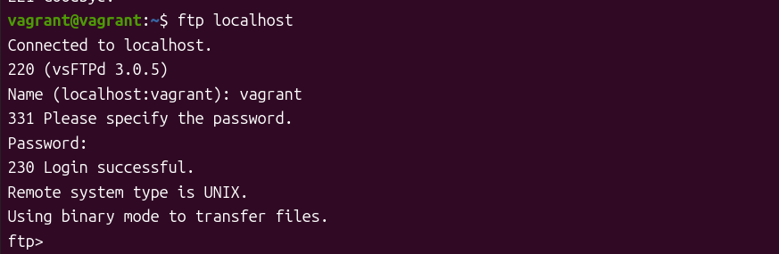

# ftpサーバーの立て方
1. commandのインストール
```sh
sudo apt update
sudo apt install vsftpd ftp
```

2. ftpサーバがあるか確認
```sh
sudo systemctl status vsftpd
```


3. 設定ファイルの書き換え
```txt
listen=YES #変更
listen_ipv6=NO #変更
anonymous_enable=YES　#変更
local_enable=YES
dirmessage_enable=YES
use_localtime=YES
xferlog_enable=YES
connect_from_port_20=YES
secure_chroot_dir=/var/run/vsftpd/empty
pam_service_name=vsftpd
rsa_cert_file=/etc/ssl/certs/ssl-cert-snakeoil.pem
rsa_private_key_file=/etc/ssl/private/ssl-cert-snakeoil.key
ssl_enable=NO
```

4. ftp ユーザの追加
```sh
sudo vi /etc/vsftpd.user_list
```
5. 今回接続するユーザ
```txt
vagrant
test
```
6. firewallの無効化
```sh
sudo ufw disable
sudo ufw status
```
7. firewallの停止
```sh
sudo systemctl stop ufw
sudo systemctl status ufw
```
8. 設定の適用
```sh
sudo systemctl restart vsftpd
```

- 接続の確認<br>

