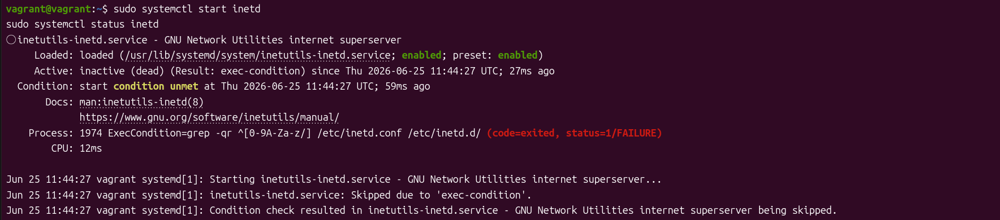

# telnet serverの立ち上げかた

1. インストール
```sh
sudo apt update
sudo apt install telnetd
```
- 以下のコマンドで立ち上げて確認
```sh
sudo systemctl start inetd
sudo systemctl status inetd
```

2. telnetの設定ファイルを開いて編集します。
```sh
sudo vi /etc/inetd.conf
```
- 以下の内容に変更(コメントされているのを外す　無ければ追記)

3. 設定を読み込む
```sh
sudo systemctl restart inetd
```
4. 読み込まれているか確認
```sh
 sudo systemctl status inetd
```
<br>
- errorがなければ完成
